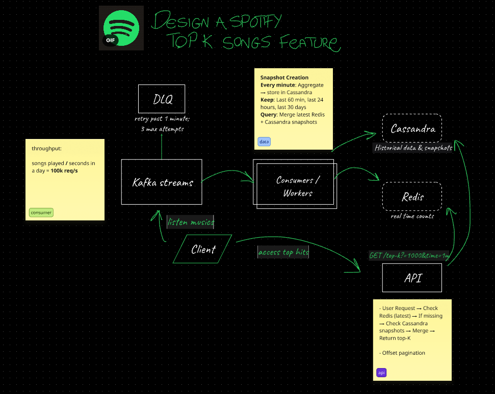

I'll enhance the README with a summary section that includes links to each major section. Here's the update:

markdown
# 🎵 Spotify Top-K Songs Analytics Platform

A high-performance, real-time analytics platform that tracks and ranks the most played songs on Spotify using a modern microservices architecture.

Big kudos to NeetCodeIO for inspiring me to create this project based on his recent video [Design Spotify Top K Songs - System Design Interview](https://www.youtube.com/watch?v=HjazbLlrWxI)

## 📋 Summary

1. [🌟 Core Features](#-core-features) - Key capabilities of the platform
2. [🏗️ System Architecture](#%EF%B8%8F-system-architecture) - High-level design and components
3. [🛠️ Development](#%EF%B8%8F-development) - Setup and workflow for developers
4. [📈 Monitoring & Debugging](#-monitoring--debugging) - Tools and tips for troubleshooting
5. [🧪 Testing](#-testing) - How to run tests
6. [🚀 Deployment](#-deployment) - Production deployment guide
7. [📚 Documentation](#-documentation) - API docs and architecture decisions

---
## 🌟 Core Features

[🔝 Back to Summary](#-summary)

- ⚡ **Real-time Analytics**: Process millions of events with sub-second latency
- 📊 **Multi-timeframe Insights**: From minutes to years of historical data
- 🚀 **High Throughput**: Handles 10K+ events per second
- 🔄 **Fault Tolerance**: Automatic retries and dead-letter queue support

---
## 🏗️ System Architecture

[🔝 Back to Summary](#-summary)



### Data Flow
1. **📥 Ingestion**: Kafka consumers process song play events
2. **⚡ Processing**: Real-time aggregation in Redis
3. **💾 Persistence**: Periodic snapshots to Cassandra
4. **🔍 Query**: Combined real-time + historical data retrieval

### Core Components
- **📡 Kafka**: Event streaming
- **🔴 Redis**: Real-time counters and leaderboards
- **📊 Cassandra**: Historical data storage
- **☕ Spring Boot**: Microservices framework

---
## 🛠️ Development

[🔝 Back to Summary](#-summary)

### Start Services
```bash
# Start infrastructure
./scripts/start-infra.sh

# Start applications
./scripts/run-spotify-topk.sh

# Check service status
./scripts/health-check.sh
```

## 📈 Monitoring & Debugging

[🔝 Back to Summary](#-summary)

### Quick Commands
```bash
# View logs
./scripts/logs.sh [api|consumer|kafka]

# Check container status
docker-compose ps

# View resource usage
docker stats
```

## 🧪 Testing

[🔝 Back to Summary](#-summary)

```bash
# Run unit tests
mvn test

# Run integration tests
mvn verify -Pintegration
```

## 🚀 Deployment

[🔝 Back to Summary](#-summary)

### Production Build
```bash
mvn clean package -DskipTests
```

### Containerization
```bash
docker build -t spotify-topk-api ./api
docker build -t spotify-topk-consumer ./consumer
```